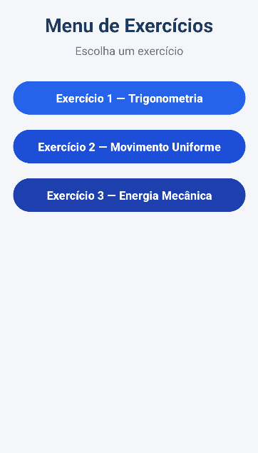
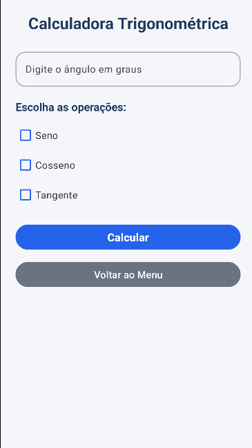
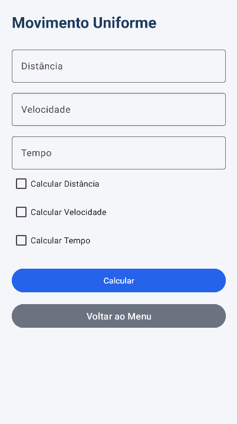
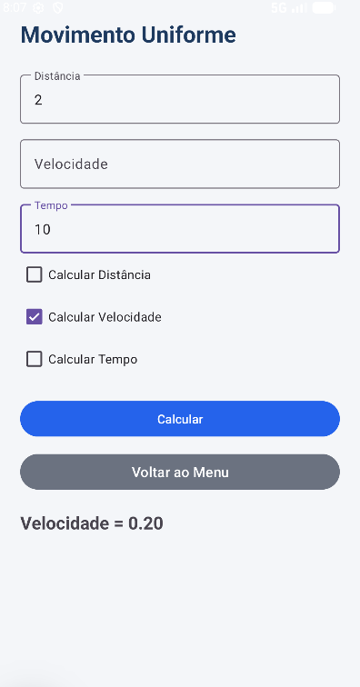
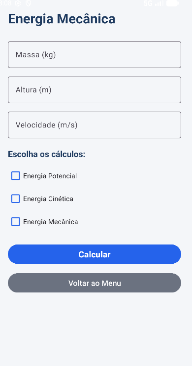

# 📱 SmartCalc Android

Aplicativo Android desenvolvido em Kotlin com exercícios de Matemática e Física utilizando Material Design.

O projeto foi criado com foco em prática acadêmica, lógica de programação, validação de entradas e navegação entre telas no Android Studio.

---

# 🚀 Funcionalidades

## 📐 Exercício 1 — Trigonometria

Cálculo de:
- Seno
- Cosseno
- Tangente

Com entrada de ângulo em graus e seleção por CheckBox.

### Fórmulas

```math
\sin(\theta)
```

```math
\cos(\theta)
```

```math
\tan(\theta)=\frac{\sin(\theta)}{\cos(\theta)}
```

---

## 🚗 Exercício 2 — Movimento Uniforme (MU)

Cálculo de:
- Distância
- Velocidade
- Tempo

### Fórmulas

```math
d = v \cdot t
```

```math
v = \frac{d}{t}
```

```math
t = \frac{d}{v}
```

O aplicativo desabilita automaticamente o campo da variável que será calculada.

---

## ⚡ Exercício 3 — Energia Mecânica

Cálculo de:
- Energia Potencial
- Energia Cinética
- Energia Mecânica

### Fórmulas

```math
E_p = mgh
```

```math
E_c = \frac{1}{2}mv^2
```

```math
E_m = E_p + E_c
```

---

# 🎨 Interface

O aplicativo possui:
- Splash Screen
- Menu principal
- Navegação entre Activities
- Material Design
- Campos com validação
- Tratamento de erros com Toast
- Layout moderno e responsivo

---

# 🛠️ Tecnologias utilizadas

- Kotlin
- Android Studio
- XML
- Material Design Components

---

# 📂 Estrutura do projeto

```bash
app/
├── MainActivity.kt
├── SplashActivity.kt
├── TrigonometriaActivity.kt
├── MovimentoUniformeActivity.kt
├── EnergiaMecanicaActivity.kt
```

---

# ▶️ Como executar

## 1. Clone o repositório

```bash
git clone URL_DO_REPOSITORIO
```

## 2. Abra no Android Studio

## 3. Execute em um emulador ou dispositivo físico

---

# 📸 Telas do aplicativo

## Splash Screen


## Menu Principal


## Tela de Trigonometria


## Tela de Movimento Uniforme




## Tela de Energia Mecânica

---
